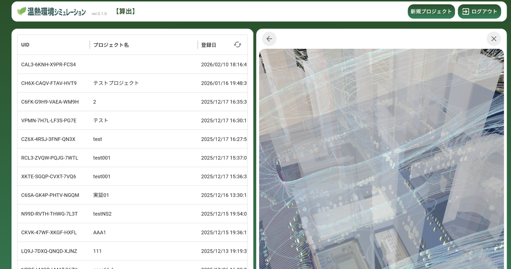

# 温熱環境シミュレーション機能

## 更新履歴
| 更新日時 | リリース | 更新内容 |
|-------------|--------------|----------------------------------------------|
| 2026/3/19 | 1st Release | 初版リリース |

## 1. 概要
本リポジトリでは、Project PLATEAUの令和7年度のユースケース開発業務の一部であるUC25-11「樹木データを活用した温熱環境シミュレータの開発」について、その成果物である「温熱環境シミュレーション機能」のソースコードを公開しています。

温熱環境シミュレーション機能は、3D都市モデルを活用して、対象エリアのがい日射や地表熱伝導率等の外力を設定し、温熱環境のシミュレーションを実行するために開発されたWebアプリケーションです。

## 2. 「温熱環境シミュレーション機能」について
植生モデルを含む3D都市モデルに対し、日射や地表熱伝導率などの外力を設定し、対象エリアの温熱環境のシミュレーションを行い、温度、湿度、WBGTを算出する機能です。

本システムの詳細については[技術検証レポート](https://www.mlit.go.jp/plateau/file/libraries/doc/plateau_tech_doc_0136_ver01.pdf)を参照してください。

## 3. 利用手順
本システムの構築手順及び利用手順については[利用チュートリアル](https://project-plateau.github.io/green-thermal-simulation)を参照してください。

## 4. システム概要
#### ①プロジェクト一覧
- 作成済みのシミュレーションプロジェクトを一覧表示します
- 各プロジェクトの処理ステータス（処理待機中・処理中・完了）を確認できます

#### ②プロジェクト設定・シミュレーション実行
- 地図上でシミュレーション対象領域をポリゴンで指定します
- 以下の環境条件を入力してシミュレーションを実行します
  - 環境設定：気温（°C）・湿度（%）・風速（m/s）・風向き（北/東/南/西）
  - 表面温度設定：ビル壁面・地面・道路・水面

#### ③シミュレーション結果の表示
- 出力結果（温度、湿度、WBGT）を Cesium および ParaView Glance で表示します
- 出力結果はVTKおよびglTF形式でダウンロードが可能です

## 5. 利用技術

| 種別 | 名称 | バージョン | 内容 |
| --- | --- | --- | --- |
| オープンソースソフトウェア | [Apache HTTP Server](https://httpd.apache.org/) | 2.4.58 | Webアプリで配信を行うためのWebサーバソフトウェア |
| オープンソースソフトウェア | [PostGIS](https://github.com/postgis/postgis) | 3.4.1 | PostgreSQLで位置情報を扱うことを可能とする拡張機能 |
| オープンソースソフトウェア | [OpenFOAM](https://www.openfoam.com/) | v2506 | オープンソースの数値流体計算（CFD）ソフトウェア。温熱環境シミュレーションの計算エンジン |
| オープンソースライブラリ | [CesiumJS](https://github.com/CesiumGS/cesium) | 1.136 | 3Dビューワ上にデータを描画するためのライブラリ |
| オープンソースライブラリ | [React.js](https://github.com/facebook/react/releases) | 19.x | JavaScriptのフレームワーク内で機能するUIを構築するためのライブラリ |
| オープンソースライブラリ | [MapLibre GL JS](https://github.com/maplibre/maplibre-gl-js) | 5.x | ブラウザ上で地図を表示するためのライブラリ |
| オープンソースライブラリ | [MUI（Material UI）](https://mui.com/) | 7.x | ReactのUIコンポーネントライブラリ |
| オープンソースRDBMS | [PostgreSQL](https://github.com/postgres/postgres) | 16.2 | 各種配信するデータを格納するリレーショナルデータベース |
| 商用ソフトウェア | [Cesium ion](https://cesium.com/platform/cesium-ion/) | - | 3Dデータの変換と配信のクラウドサービス |
| クラウドサービス | [Firebase](https://firebase.google.com/) | - | 認証機能を提供するクラウドサービス |

## 6. 動作環境
| 項目               | 最小動作環境                                              | 推奨動作環境 |
| ------------------ | --------------------------------------------------------- | ------------ |
| OS                 | Microsoft Windows 10 以上　または macOS 12 Monterey 以上 | 同左         |
| CPU                | Pentium 4 以上                                            | 同左         |
| メモリ             | 8GB以上                                                   | 同左         |

OpenFOAM によるシミュレーション計算サーバの動作環境は以下のとおりです。

| 項目 | 動作環境 |
| --- | --- |
| OS | Linux 64bit |
| ソフトウェア | OpenFOAM v2506 |

## 7. 本リポジトリのフォルダ構成
| フォルダ/ファイル名                | 詳細                                           |
| ---------------------------------- | ---------------------------------------------- |
| public                             | 公開用静的ファイル                             |
| public/favicon.png                 | favicon画像                                    |
| src                                | アプリケーションソース                         |
| src/App.jsx                        | ルートコンポーネント                           |
| src/main.jsx                       | エントリーポイント                             |
| src/main.css                       | 全体スタイル                                   |
| src/core.jsx                       | アプリコア処理（難読化済み）                   |
| src/components                     | 共通UIコンポーネント                           |
| src/components/maplibre            | MapLibre描画UI                                 |
| src/manager                        | APIユーティリティ                              |
| src/map                            | 地図描画処理                                   |
| src/map/cesium                     | Cesiumレイヤ処理                               |
| src/map/mapbox                     | Mapboxレイヤ処理                               |
| src/map/styles                     | 地図スタイル定義                               |
| src/resources                      | 静的リソース                                   |
| src/resources/fonts                | フォント                                       |
| src/resources/map_style            | MapスタイルJSON                                |
| src/views                          | 画面UI                                         |
| src/views/auth.jsx                 | 認証画面                                       |
| src/views/login.jsx                | ログイン画面                                   |
| src/views/header.jsx               | ヘッダーUI                                     |
| src/views/main                     | メイン画面UI（プロジェクト一覧・レポート）     |
| src/views/project                  | プロジェクト設定・地図・入力フォームUI         |
| index.html                         | HTMLテンプレート                               |
| package.json                       | 依存ライブラリ定義                             |
| vite.config.js                     | Vite設定                                       |
| tsconfig.json                      | TypeScript設定                                 |
| canopyModels_v2506_tar.gz          | OpenFOAM用植生キャノピーモデルソースコード     |

## 8. ライセンス

- ソースコード及び関連ドキュメントの著作権は国土交通省に帰属します。
- 本ドキュメントは[Project PLATEAUのサイトポリシー](https://www.mlit.go.jp/plateau/site-policy/)（CCBY4.0及び政府標準利用規約2.0）に従い提供されています。

## 9. 注意事項

- 本リポジトリは参考資料として提供しているものです。動作保証は行っていません。
- 本リポジトリについては予告なく変更又は削除をする可能性があります。
- 本リポジトリの利用により生じた損失及び損害等について、国土交通省はいかなる責任も負わないものとします。

## 10. 参考資料
- 技術検証レポート: https://www.mlit.go.jp/plateau/file/libraries/doc/plateau_tech_doc_0136_ver01.pdf
- PLATEAU WebサイトのUse caseページ「樹木データを活用した温熱環境シミュレータの開発」: https://www.mlit.go.jp/plateau/use-case/uc25-11/