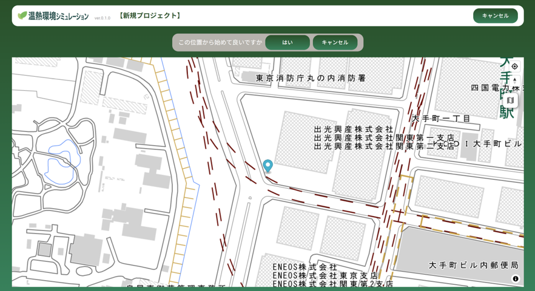

# 操作マニュアル

# 1 本書について

本書では、温熱環境シミュレーション機能（以下「本システム」という。）の操作手順について記載しています。

# 2 使い方

## 2-1 ログイン画面

本システムをデプロイしたURLにアクセスすると以下の画面が表示されます。設定したログインID（メールアドレス）、パスワードを入力することでシステムのメイン（樹木管理）画面が表示されます。

## 2-1 ログイン画面

本システムをデプロイしたURLにアクセスすると以下の画面が表示されます。設定したログインID（メールアドレス）、パスワードを入力することでシステムのメイン（樹木管理）画面が表示されます。

## 2-2 プロジェクト一覧画面

① 新規プロジェクト登録

・登録したプロジェクト一覧が表示されます

・左上「新規プロジェクト登録」から、新たなプロジェクトを登録します

## 2-3 対象エリア登録画面

① 対象エリア登録

・地図上でプロジェクトの対象エリアのおおよその位置をクリックして、エリア登録を行います

## 2-4 シミュレーション条件設定画面

① プロジェクト名称入力

・プロジェクト名称を入力します

② 環境設定

・気温、湿度、風速、風向きを設定します

③ 温度設定（表面）

・ビル壁面、地面、道路、水面の温度を設定します

④ 緑地面積等の登録

・緑化完了報告書等に記載の緑地面積等を手動で入力します

⑤ 保存およびエクスポート

・保存ボタンで登録内容を保存します

・保存後にエクスポートボタンが表示されます。算出結果をExcel形式でエクスポートします

