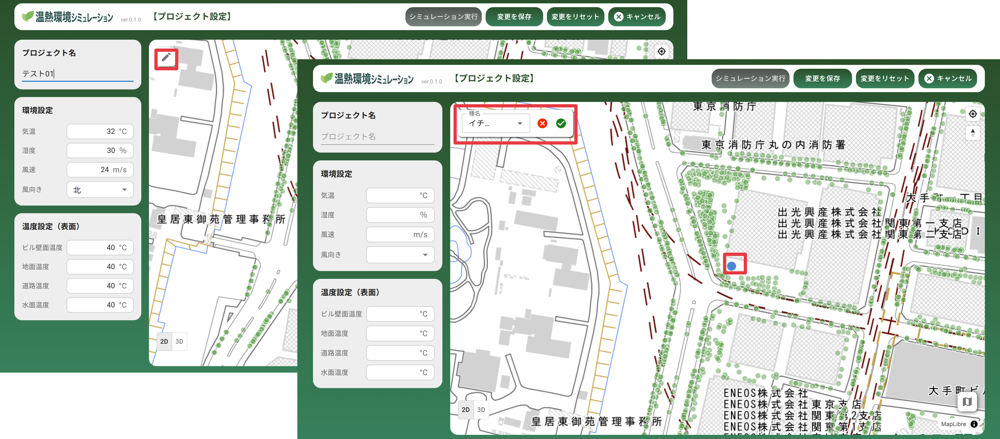
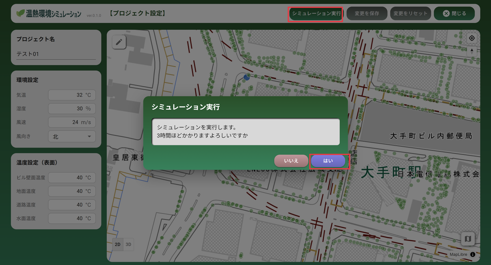
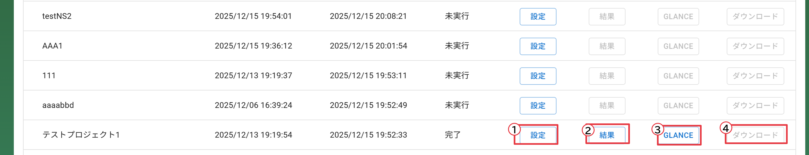

# 操作マニュアル

# 1 本書について

本書では、温熱環境シミュレーション機能の操作手順について記載しています。

# 2 使い方

## 2-1 ログイン画面

本システムを公開したURLにアクセスすると以下の画面が表示されます。設定したログインID（メールアドレス）、パスワードを入力することでシステムのメイン（樹木管理）画面が表示されます。

## 2-2 プロジェクト一覧画面

① 新規プロジェクト登録

・登録したプロジェクト一覧が表示されます

・右上「新規プロジェクト登録」から、新たなプロジェクトを登録します

## 2-3 対象エリア登録画面

① 対象エリア登録

・地図上でプロジェクトの対象エリアのおおよその位置をクリックして、エリア登録を行います。おおよそ500m四方が選択されます。

## 2-4 シミュレーション条件設定・実行画面

① プロジェクト名称入力

・プロジェクト名称を入力します

② 環境設定

・気温、湿度、風速、風向きを設定します

③ 温度設定（表面）

・ビル壁面、地面、道路、水面の温度を設定します

④ 樹木配置

・地図上の左上にある編集ボタンから、樹木を配置する場所を地図上でクリックすることで新たな樹木を配置することも可能です。

⑤ シミュレーション実行

・シミュレーション実行ボタンを押すと、設定した内容でシミュレーションを実行します。

## 2-5 シミュレーション結果可視化・ダウンロード

・プロジェクト一覧画面から、シミュレーション結果を確認することができます

① 設定

・「設定」ボタンで保存したプロジェクトの設定・再実行を行います

② 結果

・Cesiumによる可視化

③ Glance

・Paraview Glanceによる可視化（別ブラウザが起動）

④ ダウンロード

・VTK、glTF形式をZIPでダウンロード
